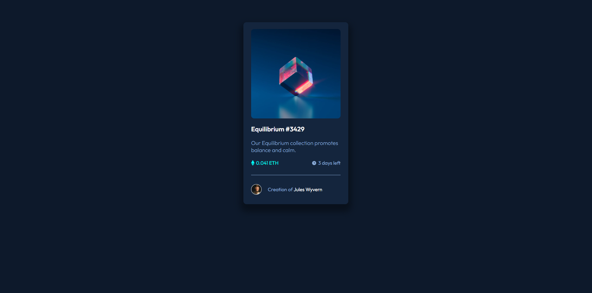

# Frontend Mentor - NFT preview card component solution

This is a solution to the [NFT preview card component challenge on Frontend Mentor](https://www.frontendmentor.io/challenges/nft-preview-card-component-SbdUL_w0U). Frontend Mentor challenges help you improve your coding skills by building realistic projects. 

## Table of contents

- [Overview](#overview)
  - [The challenge](#the-challenge)
  - [Screenshot](#screenshot)
  - [Links](#links)
  - [Built with](#built-with)
  - [Colors](#Colors)
- [Author](#author)

**Note: Delete this note and update the table of contents based on what sections you keep.**

## Overview

### The challenge

Users should be able to:

- View the optimal layout depending on their device's screen size
- See hover states for interactive elements

### Screenshot




### Links

- Solution URL: [https://github.com/CarlosFigueiredo-sci/nft-preview-card]
- Live Site URL: [https://carlosfigueiredo-sci.github.io/nft-preview-card/]

## My process

### Built with

- Semantic HTML5 markup
- CSS custom properties
- Flexbox

### Colors


```css
:root {
    /*Primary*/
    --soft-blue: hsl(215, 51%, 70%);
    --cyan: hsl(178, 100%, 50%);
    /*Neutral*/
    --veryDarkBlue-main: hsl(217, 54%, 11%);
    --veryDarkBlue-card: hsl(216, 50%, 16%);
    --veryDarkBlue-line: hsl(215, 32%, 27%);
    --white: hsl(0, 0%, 100%);
}
```

## Author
- Frontend Mentor - [@CarlosFigueiredo-sci](https://www.frontendmentor.io/profile/CarlosFigueiredo-sci)
